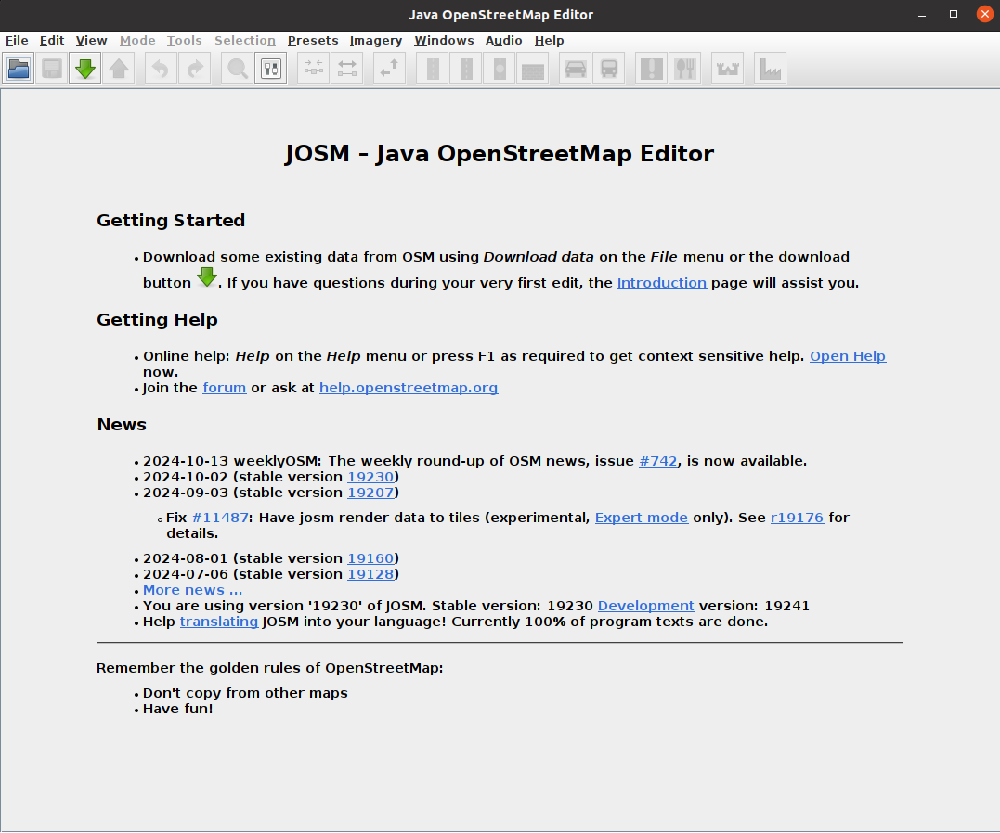
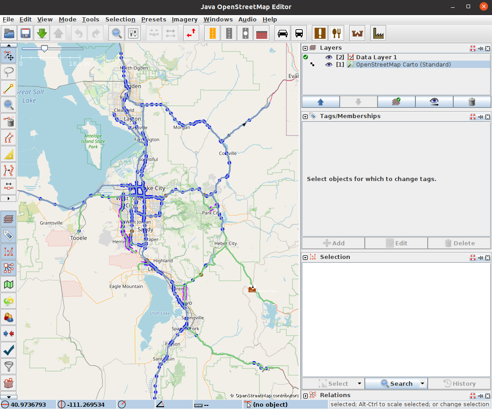
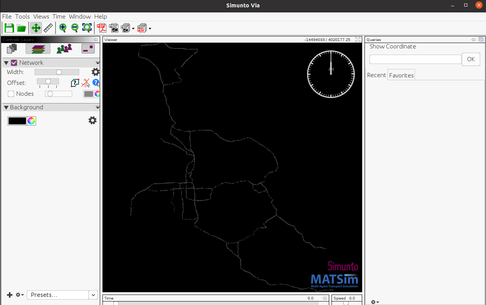

# matsim-example-project

A small example of how to use MATSim as a library.

By default, this project uses the latest (pre-)release. In order to use a different version, edit `pom.xml`.

A recommended directory structure is as follows:
* `src` for sources
* `original-input-data` for original input data (typically not in MATSim format)
* `scenarios` for MATSim scenarios, i.e. MATSim input and output data.  A good way is the following:
  * One subdirectory for each scenario, e.g. `scenarios/mySpecialScenario01`.
  * This minimally contains a config file, a network file, and a population file.
  * Output goes one level down, e.g. `scenarios/mySpecialScenario01/output-from-a-good-run/...`.
  
  
### Import into eclipse

1. download a modern version of eclipse. This should have maven and git included by default.
1. `file->import->git->projects from git->clone URI` and clone as specified above.  _It will go through a 
sequence of windows; it is important that you import as 'general project'._
1. `file->import->maven->existing maven projects`

Sometimes, step 3 does not work, in particular after previously failed attempts.  Sometimes, it is possible to
right-click to `configure->convert to maven project`.  If that fails, the best thing seems to remove all 
pieces of the failed attempt in the directory and start over.

### Import into IntelliJ

`File -> New -> Project from Version Control` paste the repository url and hit 'clone'. IntelliJ usually figures out
that the project is a maven project. If not: `Right click on pom.xml -> import as maven project`.

### Java Version

The project uses Java 11. Usually a suitable SDK is packaged within IntelliJ or Eclipse. Otherwise, one must install a 
suitable sdk manually, which is available [here](https://openjdk.java.net/)

### Building and Running it locally

You can build an executable jar-file by executing the following command:

```sh
./mvnw clean package
```

or on Windows:

```sh
mvnw.cmd clean package
```

This will download all necessary dependencies (it might take a while the first time it is run) and create a file `matsim-example-project-0.0.1-SNAPSHOT.jar` in the top directory. This jar-file can either be double-clicked to start the MATSim GUI, or executed with Java on the command line:

```sh
java -jar matsim-example-project-0.0.1-SNAPSHOT.jar
```


### Licenses
(The following paragraphs need to be adjusted according to the specifications of your project.)

The **MATSim program code** in this repository is distributed under the terms of the [GNU General Public License as published by the Free Software Foundation (version 2)](https://www.gnu.org/licenses/old-licenses/gpl-2.0.en.html). The MATSim program code are files that reside in the `src` directory hierarchy and typically end with `*.java`.

The **MATSim input files, output files, analysis data and visualizations** are licensed under a <a rel="license" href="http://creativecommons.org/licenses/by/4.0/">Creative Commons Attribution 4.0 International License</a>.
<a rel="license" href="http://creativecommons.org/licenses/by/4.0/"></a><br /> MATSim input files are those that are used as input to run MATSim. They often, but not always, have a header pointing to matsim.org. They typically reside in the `scenarios` directory hierarchy. MATSim output files, analysis data, and visualizations are files generated by MATSim runs, or by postprocessing.  They typically reside in a directory hierarchy starting with `output`.

**Other data files**, in particular in `original-input-data`, have their own individual licenses that need to be individually clarified with the copyright holders.


# Working with MATSim - Isaac

This guide explains how to get a real-world network into MATSim, generate a population, and run a simulation. It assumes that you have the .jar executable compiled and ready to use.

## Getting a Real Network in MATSim

### Step 1: Download the Network

1. Visit [JOSM's website](https://josm.openstreetmap.de/) and download the `josm-tested.jar` file.
2. Run JOSM with the following command:

   ```bash
   java -jar josm-tested.jar
   ```

3. The JOSM interface should appear:
   
   

4. Enable expert mode by clicking on **View** and checking the **Expert mode** box.

5. Navigate to **File → Download Data**. In the download window, switch to the **Download from Overpass API** tab and enter a query.

### Example Overpass API Query

To download a bounding box of road data for the state of Utah, use:

```plaintext
[out:xml];
(
  way["highway"~"motorway|trunk"](39.647,-112.543,41.894,-111.148); //(min latitude, min longitude, max latitude, max longitude)
);
out body;
>;
out skel qt;
```

You can customize this query to include additional roadway types beyond `motorway` and `trunk`. The [Overpass API documentation](https://wiki.openstreetmap.org/wiki/Overpass_API) has more information.

#### Common Road Types:

- **motorway**: Highways or freeways with controlled access.
- **trunk**: Major roads that aren't motorways.
- **primary**, **secondary**, **tertiary**: Roads of varying levels of importance.
- **residential**: Streets within residential areas.
- **living_street**: Streets primarily for pedestrians with limited vehicle access.
- **service**: Roads for accessing buildings, parking lots, etc.
- **footway**, **cycleway**, **path**: Paths for pedestrians and cyclists.
- **track**: Roads mainly used for agricultural or forestry purposes.
- **unclassified**: Roads without a specific classification.

### Step 2: Edit the Network

In the JOSM editor, you can make sure that roads are connected properly. To display the map background, go to **Imagery → OpenStreetMap Carto (Standard)**.



Once you're satisfied with the network, save it by going to **File → Save As** and choosing `.osm` as the file format.

## Cleaning the .osm File

Use the script provided in `python/scripts/` named `clean_osm_data.py` to clean the `.osm` file. An example of how to run the script:

```bash
python python/scripts/clean_osm_data.py --input path/to/input_graph.osm --output path/to/cleaned_graph.osm
```

The cleaned `.osm` file can now be converted to a MATSim-compatible `.xml` file.

## Converting .osm to MATSim-Compatible .xml

Use the [osm2matsim converter](https://github.com/gustavocovas/osm2matsim), included in this repository at `/osm2matsim`. Place your `.osm` file in the `osm2matsim/input` directory for simplicity. To convert:

```bash
cd osm2matsim
./bin/convert.sh input/input.osm output/output.xml
```

## Generating a Population

Now that you have a MATSim-compatible network `.xml`, you can generate a population:

```bash
python python/scripts/create_population.py --input path/to/matsimnetwork.xml --output path/to/matsimplansoutput.xml --numagents 100
```

The above command generates travel plans for 100 agents.

## Running MATSim

With a network and population ready, you can start the MATSim simulation. Run the .jar file as follows:

```bash
java -jar matsim-example-project-0.0.1-SNAPSHOT.jar
```

When the MATSim GUI appears, it will prompt you to load a `config.xml` file. Example configurations can be found in `scenarios/utah/utah_config.xml`. Update the `inputNetworkFile` and `inputPlansFile` parameters in the configuration with the paths to your generated `network.xml` and `plans.xml`.

Once the configuration is loaded, click **Start MATSim**. After the simulation completes, an output directory will be created near the location of your `config.xml` file.

## Visualizing the Simulation

To visualize the simulation results, use [Via](https://www.simunto.com/via/download.html). The Via runnable is included in this repository. To start it:

```bash
./Via-24.1.0/via
```

You may need a license to use Via. A free license can be obtained [here](https://www.simunto.com/via/licenses/free), which allows visualization of up to 500 agents.

Once Via is open:

1. In the **Controls:** tab, click the paper icon labeled **Data Sources**, then click the `+` icon at the bottom.
2. Navigate to the MATSim output folder and add the `output_network.xml.gz` file.
3. Repeat the process to add the `output_events.xml.gz` file.
4. Switch to the **Controls: Layers** tab, click the `+` icon, select **Network**, and click **Add**. The network should appear.



Next, add the **Vehicle From Events** layer and click **Load Data**. You can adjust the simulation speed at the bottom right of the interface to see green agents moving throughout the day.

---

This guide provides a structured approach to setting up and running MATSim simulations using real-world networks. Each step ensures the preparation of the network, population, and visualization of the simulation results.